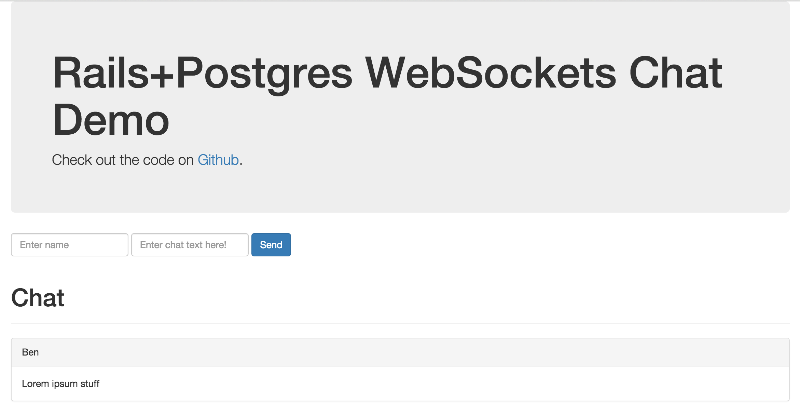

# Rails+Postgres WebSockets Chat Demo

Based on [Heroku's Ruby Websockets Chat Demo](https://github.com/heroku-examples/ruby-websockets-chat-demo), but uses Postgres `LISTEN/NOTIFY` for message passing instead of Redis, and also persists chat messages in Postgres too. This has *no dependency on Redis*. 

